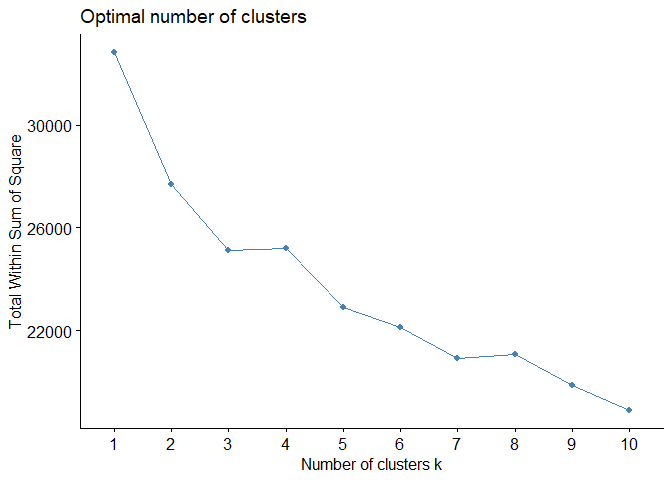
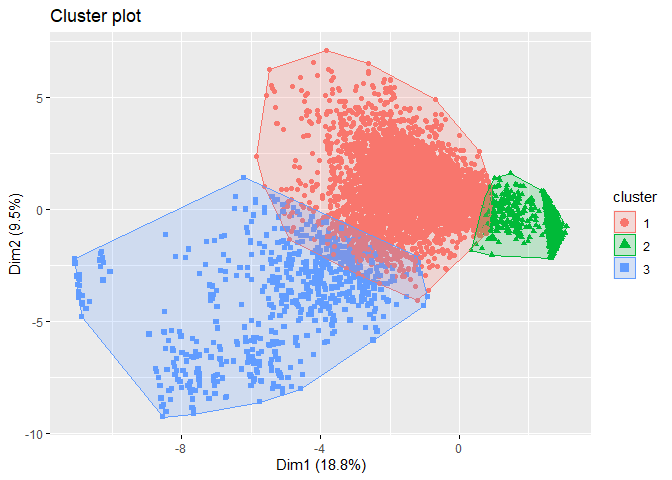
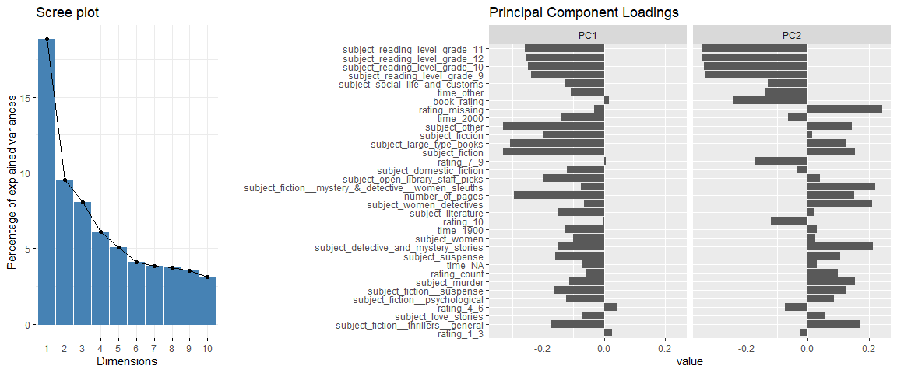
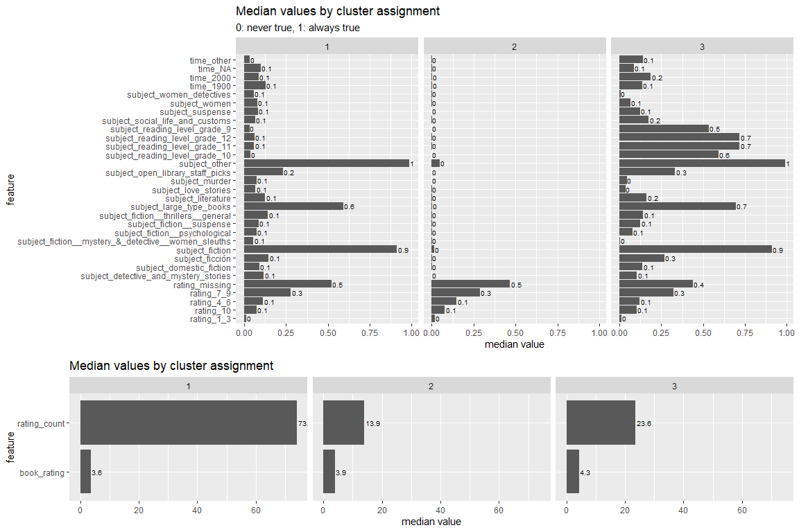

Recommending
================

### Approaches

Resources  
\-
<https://medium.com/@cfpinela/recommender-systems-user-based-and-item-based-collaborative-filtering-5d5f375a127f>

MY APPROACH  
\- Compute correlation between products based on what’s purchased
together  
\- Sort by strongest correlations  
\- Identify customers not purchasing both  
\- Estimate value of opportunity

OTHER APPROACHES - Market basket  
\- At transaction level, so not appropriate for this purpose.  
\- Understand the chance that someone buys milk if they have butter in
their cart.  
\- Association rules:  
\- Support: P(milk + butter)  
\- Confidence: support/P(butter)  
\- Lift: confidence/P(milk)  
\- User-based collaborative filtering  
\- Find K nearest neighbors to user  
\- Predict how they would rate items their nearest neighbors rated  
\- Item-based collaborative filtering  
\- Compute cosine/correlation-based/1-jaccard similarity for the items  
\- Predict the user’s “rating” for each item (weighted sum/regression)  
\- SVD

### Data

  - <https://www.kaggle.com/ruchi798/bookcrossing-dataset>

### Cluster users

<!-- --><!-- -->

    ## # A tibble: 3 x 5
    ##   cluster count_users ratings pct_users pct_ratings
    ##     <int>       <int>   <dbl> <chr>     <chr>      
    ## 1       1        5022  371133 52%       83.9%      
    ## 2       2        4013   55689 41%       12.6%      
    ## 3       3         657   15474 7%        3.5%

<!-- -->

<!-- -->

  - Cluster 1: Users who have purchased a lot of books, particularly
    fiction, large type, and “other” subject books.  
  - Cluster 2: Users who have purchased the least amount of books,
    especially books that we are missing information about.  
  - Cluster 3: Users who have the second lowest purchase count, but tend
    to rate a little higher. They read “reading level” subject matter,
    literature, and books set in the 2000s, more than other users.
